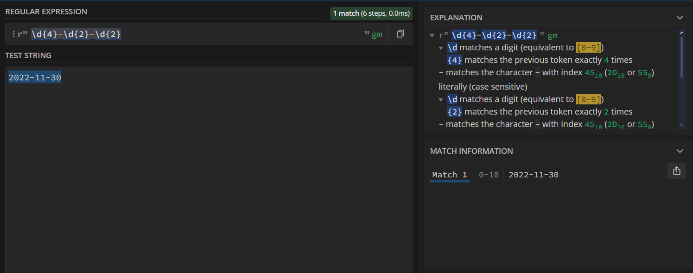
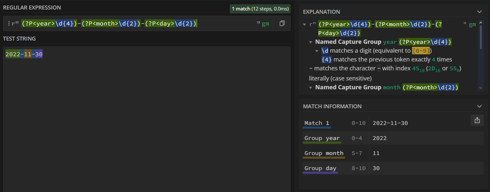

# Projeto Integrador Transdisciplinar - ADS 2024.1

Esse é o projeto da disciplina Projeto Integrador Transdisciplinar em Análise e
Desenvolvimento de Sistemas I, da Universidade Cruzeiro do Sul.

O projeto consiste em uma solução que converte datas do formato YYYY-MM-DD ([padrão ISO 8601](https://pt.wikipedia.org/wiki/ISO_8601)) para o formato brasileiro de datas: DD/MM/YYYY.

## Expressão regular utilizada

A expressão regular para identificar o formato ISO 8601 de data poderia ser a seguinte: `/\d{4}-\d{2}-\d{2}/`



Contudo, pensei em usar grupos nomeados na expressão regular para facilitar o código que usaria esse resultado na separação do dia, mês e ano. Seria assim: `(?P<year>\d{4})-(?P<month>\d{2})-(?P<day>\d{2})`



## Utilização do algoritmo

O algoritmo substitui converte datas no formato ISO-8601 para o formato brasileiro em qualquer arquivo de texto e escreve o resultado em outro arquivo. Eu deixei arquivos de exemplo [para a entrada](./input-example.csv) e [para a saída](./output-example.csv).

Para usar valores diferentes para o arquivo de entrada e de saída, basta passá-los em ordem como argumentos para o comando de execução do código:

```bash
# exemplo com arquivos csv
python main.py "input.csv" "output.csv"
```

```bash
# exemplo com arquivos txt
python main.py "input.txt" "output.txt"
```
